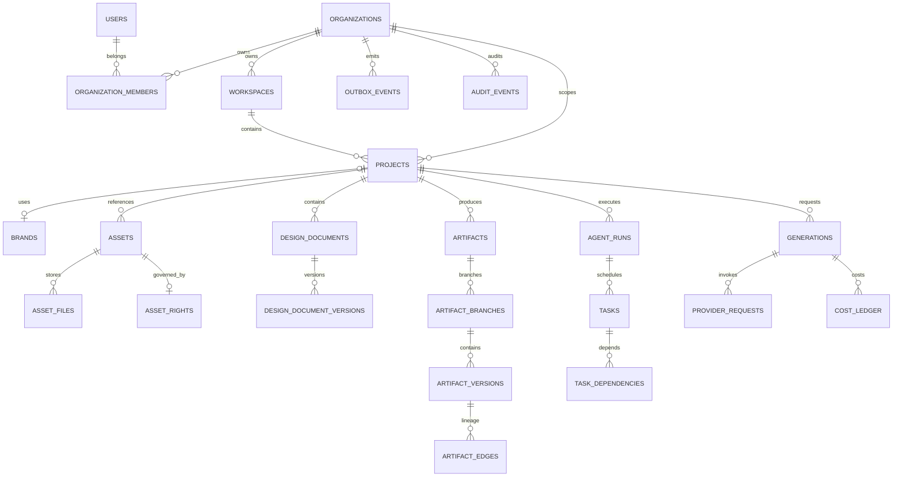

# LUMI AI Design OS — Database Schema V1

> Node: `NODE-10`  
> Status: **IMPLEMENTED / VALIDATING**  
> Database: PostgreSQL 16 + pgvector  
> ORM: SQLAlchemy 2 async  
> Driver: asyncpg  
> Migration: Alembic  
> Domain source of truth: `services/domain/src/lumi_domain`

---

## 1. Architecture rule

The database is a persistence adapter for the NODE-09 domain model. It is not allowed to redefine domain meaning.

```text
Domain Model
    ↓ repository ports
Persistence Adapters
    ↓
SQLAlchemy Models
    ↓
Frozen Alembic Revisions
    ↓
PostgreSQL
```

Hard boundaries:

```text
Domain entity != SQLAlchemy model
Domain state  != database row lifecycle
Design IR     != renderer scene graph
Provider ID   != domain UUID
Cost ledger   != mutable balance row
```

## 2. Technology baseline

```text
PostgreSQL 16
pgvector extension
pgcrypto extension
SQLAlchemy 2.0 async engine/session
asyncpg driver
Alembic async migrations
application-generated UUIDv7 domain IDs
JSONB for evolving structured payloads
NUMERIC for money/usage precision
```

Runtime and migration credentials are separated:

```text
DATABASE_URL           -> lumi_app
MIGRATION_DATABASE_URL -> lumi_migration
```

The API runtime role never requires DDL permission.

## 3. P0 table inventory

The initial schema contains **41 application tables**.

### 3.1 Identity & Tenancy — 7

| Table | Purpose |
|---|---|
| `users` | global user identity |
| `organizations` | tenant ownership root |
| `organization_members` | organization membership/role |
| `workspaces` | collaboration/project container |
| `workspace_members` | workspace membership/role |
| `auth_identities` | external auth provider subject mapping |
| `sessions` | hashed session token state |

### 3.2 Project & Brand — 7

| Table | Purpose |
|---|---|
| `projects` | project business lifecycle |
| `project_members` | project membership/role |
| `brands` | brand profile |
| `brand_palettes` | versionable palette records |
| `brand_fonts` | typography references |
| `brand_logos` | logo asset references/rules |
| `brand_rules` | machine-readable brand constraints |

### 3.3 Assets — 6

| Table | Purpose |
|---|---|
| `assets` | input/reference asset identity |
| `asset_files` | storage variants + checksum/mime/dimensions |
| `asset_previews` | thumbnail/preview mapping |
| `asset_metadata` | namespaced derived metadata |
| `asset_embeddings` | vector embedding records |
| `asset_rights` | rights/licensing policy |

### 3.4 Design / Artifact / Provenance — 8

| Table | Purpose |
|---|---|
| `design_documents` | editable structured design identity |
| `design_document_versions` | immutable Design IR snapshots |
| `artifacts` | deliverable identity |
| `artifact_branches` | version branch/head |
| `artifact_versions` | immutable content version identity + approval status |
| `artifact_edges` | lineage DAG edges |
| `artifact_files` | exported/rendered files by version/format |
| `artifact_provenance` | source/operation provenance |

### 3.5 Agent / Workflow / Generation — 7

| Table | Purpose |
|---|---|
| `agent_runs` | business record of an agent execution |
| `agent_run_steps` | ordered step history/status |
| `tasks` | persistent schedulable task unit |
| `task_dependencies` | task DAG edges |
| `approvals` | human approval records |
| `generations` | normalized model generation/edit request |
| `provider_requests` | provider-native request/usage/error record |

### 3.6 Platform — 6

| Table | Purpose |
|---|---|
| `cost_ledger` | append-only cost movement ledger |
| `usage_counters` | period/metric aggregate counters |
| `idempotency_operations` | paid/side-effect operation identity |
| `outbox_events` | transactional event outbox |
| `inbox_events` | consumer dedupe record |
| `audit_events` | append-only audit history |

## 4. High-level relationship map



This diagram is semantic and intentionally omits some low-level foreign keys for readability.

## 5. Tenant strategy

All tenant-owned business records carry `organization_id` directly even when the tenant could be inferred through another foreign key.

Reasons:

- every high-risk query can include an explicit tenant predicate;
- composite tenant indexes remain available;
- audit/cost/event records remain tenant searchable without deep joins;
- future row-level security can be added without redesigning ownership columns.

Repository policy:

```text
TenantRepository(session, organization_id, Model)
→ scoped(select(Model))
→ WHERE Model.organization_id = :tenant
```

No repository may infer tenant scope from user-controlled object IDs alone.

NODE-16 will add authenticated membership/RBAC adapters; NODE-10 only provides persistence-level ownership structure.

## 6. ID strategy

All business IDs are UUID columns populated by application-generated UUIDv7 values.

Rules:

- no public auto-increment IDs;
- no `gen_random_uuid()` server default for domain IDs;
- provider-native IDs live in `provider_requests`/`ProviderRef`;
- deterministic seed uses fixed UUIDv7-shaped values;
- timestamps remain separate columns for explicit business/query semantics.

## 7. Mutable vs immutable records

### Mutable business state

Examples:

```text
projects
assets
brands
artifact_branches
agent_runs
tasks
approvals
provider_requests
idempotency_operations
usage_counters
```

Mutable rows use `updated_at` and an integer `version` where optimistic concurrency is useful.

### Append-only / immutable history

Database triggers reject `UPDATE` and `DELETE` on:

```text
design_document_versions
artifact_edges
artifact_files
artifact_provenance
cost_ledger
inbox_events
audit_events
```

Runtime role permissions also expose only `SELECT` + `INSERT` for those tables.

`artifact_versions` is special: content identity is immutable, while workflow metadata may progress. Runtime receives:

```text
INSERT
UPDATE(status, quality_score)
SELECT
```

It does not receive broad UPDATE/DELETE permission.

## 8. Soft-delete policy

P0 uses `deleted_at` only on:

```text
projects
assets
```

Reason: these are recoverable user-facing containers/resources. Immutable histories, financial/audit records and version lineage are not soft-deleted as a substitute for retention/governance.

Future retention/legal-hold semantics belong to NODE-65.

## 9. Precision policy

Never use floating point for money or billable quantities.

```text
cost_ledger.amount      NUMERIC(20,8)
cost_ledger.quantity    NUMERIC(30,10)
usage_counters.quantity NUMERIC(30,10)
tasks.budget_reserved   NUMERIC(20,8)
```

Currency is `CHAR(3)` and constrained to uppercase three-letter values.

Visual quality scores may use floating point because they are non-financial evaluation values.

## 10. Asset storage policy

`assets` is the semantic resource identity. Object storage details live in `asset_files`.

Every asset file persists:

```text
bucket
object_key
checksum_sha256
mime_type
byte_size
width?
height?
variant
```

The database never stores large media bytes.

`asset_rights` is separate from `asset_files`; storage location does not imply commercial rights.

## 11. Vector strategy

`asset_embeddings` uses PostgreSQL pgvector with:

```text
embedding vector
embedding_model
embedding_version
content_hash
dimensions
```

NODE-10 intentionally does **not** invent one global vector dimension or ANN index because NODE-07 has not selected a single embedding model/dimension as a production winner.

ANN/index policy is added only after the active embedding model and dimensionality are benchmarked/frozen. This prevents an irreversible schema optimization around an unverified model choice.

## 12. Artifact lineage and Task DAG

### Artifact lineage

`artifact_edges` stores directed version-to-version edges.

Database guards:

- self-loop CHECK;
- unique `(from, to, edge_type)`.

Domain/service guards:

- full cycle detection remains in NODE-09/15 logic.

### Task graph

`task_dependencies` stores `task_id -> depends_on_task_id`.

Database guards:

- self-loop CHECK;
- unique edge.

Domain/service guards:

- full DAG cycle detection;
- readiness/scheduling semantics.

This split avoids complex graph triggers while still rejecting cheap local corruption at the database boundary.

## 13. Optimistic concurrency

`ProjectRepositoryAdapter.save_with_expected_version()` performs:

```text
UPDATE projects
SET ..., version = version + 1
WHERE id = :id
  AND organization_id = :organization_id
  AND version = :expected_version
  AND deleted_at IS NULL
RETURNING version
```

No matching row raises `OptimisticLockError`.

The same pattern can be reused by later mutable aggregates.

## 14. Idempotency and paid side effects

`idempotency_operations` has tenant-local uniqueness:

```text
UNIQUE (organization_id, idempotency_key)
```

`generations.operation_id` references the idempotency operation.

NODE-20 will implement reconciliation/retry semantics; NODE-10 establishes the durable identity required for them.

## 15. Cost ledger

`cost_ledger` is append-only.

A correction is represented by a new row:

```text
reverses_entry_id -> previous CostLedger.id
entry_type         -> reversal / adjustment
amount             -> signed Decimal amount
```

There is no `updated_at` and database triggers reject UPDATE/DELETE.

This keeps provider billing reconciliation auditable.

## 16. Transactional Outbox / Inbox

`outbox_events` is written using the same SQLAlchemy `AsyncSession` as the business mutation.

Expected transaction:

```text
BEGIN
  mutate aggregate rows
  insert outbox_event
COMMIT
```

If the transaction rolls back, neither business state nor the event survives.

`inbox_events` has:

```text
UNIQUE (consumer, event_id)
```

for consumer deduplication.

NODE-12/19 own event envelope/queue delivery and retry behavior.

## 17. Indexing policy

P0 indexes follow likely access paths, not blanket indexing:

```text
organization_id + created_at
organization_id + status
project_id + created_at
project_id + status
task scheduling status/priority/created_at
artifact/version lineage directions
provider native request lookup
outbox published_at + created_at
cost by organization/project/generation/provider-request
```

No ANN embedding index is created until vector dimensions/provider choice are frozen.

Future indexes must be justified by query plans/production evidence rather than speculative additions.

## 18. Runtime vs migration privileges

Local PostgreSQL bootstrap creates:

```text
lumi_migration  # DDL owner/migration role
lumi_app        # runtime DML role
```

Alembic only accepts `MIGRATION_DATABASE_URL`.

The final migration head (`0003_runtime_privilege_hardening`) performs defense in depth:

1. revoke broad runtime writes;
2. grant SELECT;
3. grant explicit table/column write permissions;
4. install immutable-history triggers;
5. revoke future default write privileges for migration-owned tables.

Future migrations must grant new runtime writes explicitly.

## 19. Migration chain

P0 frozen revisions:

```text
0001_domain_core_schema
  ↓
0002_workflow_platform_schema
  ↓
0003_runtime_privilege_hardening
```

Historical revisions use static DDL snapshots. They do not call `Base.metadata.create_all()` and do not import future live model definitions to build old schema.

Alembic autogeneration may help draft future revisions, but generated migrations must be reviewed before commit.

## 20. Schema drift gate

After upgrading a real database to head:

```text
alembic check
```

must report no structural changes needed.

Configuration:

```text
compare_type = true
compare_server_default = false
```

Reason: frozen migration DDL owns server-default implementation while ORM defaults frequently express client-side construction semantics. Type/table/column/index/constraint drift remains actionable; equivalent client/server default placement is not treated as an automatic failure.

## 21. Migration rollout policy

Production migrations follow expand/backfill/switch/contract:

```text
1. Expand
   additive nullable columns/tables/indexes

2. Backfill
   resumable/idempotent data job

3. Switch
   deploy application code reading/writing new structure

4. Contract
   remove obsolete columns/constraints only after compatibility window
```

Destructive rename/drop in a single release is prohibited for production-critical data.

## 22. Deterministic seed

`lumi_api.persistence.seed` inserts fixed fixtures with `ON CONFLICT DO NOTHING`:

```text
2 users
1 organization + memberships
1 workspace
1 brand
2 projects
1 image asset + file + rights
1 design document
1 artifact branch
2 artifact versions + EDITED_FROM edge
2 tasks + dependency
```

The seed is repeatable and intended for integration/E2E fixtures, not random demo state.

## 23. Database validation workflow

Dedicated GitHub workflow: `.github/workflows/database-schema.yml`.

Once external Actions billing is restored and `uv.lock` is regenerated, it must execute:

```text
uv sync --all-packages --frozen
make infra-up
empty DB -> alembic head
alembic check
seed
verify current revision
downgrade -1 -> upgrade head
alembic check
live persistence tests
cleanup
```

Live tests cover:

- exact migration head and table count;
- tenant isolation;
- optimistic locking;
- Decimal precision;
- DB-level immutable ledger rejection;
- business-write + outbox transaction rollback atomicity.

## 24. Current validation boundary

The implementation exists, but NODE-10 is not marked COMPLETE until:

1. GitHub Actions billing/spending is fixed;
2. dependency resolution runs for the new SQLAlchemy/Alembic/asyncpg/pgvector dependencies;
3. generated `uv.lock` is committed rather than hand-edited;
4. Ruff/Pyright/Pytest pass on Python 3.12;
5. Database Schema workflow passes against real PostgreSQL;
6. existing contract/security/regression gates remain green.

Until then the correct status is **IMPLEMENTED / VALIDATING / BLOCKED_EXTERNAL**.
