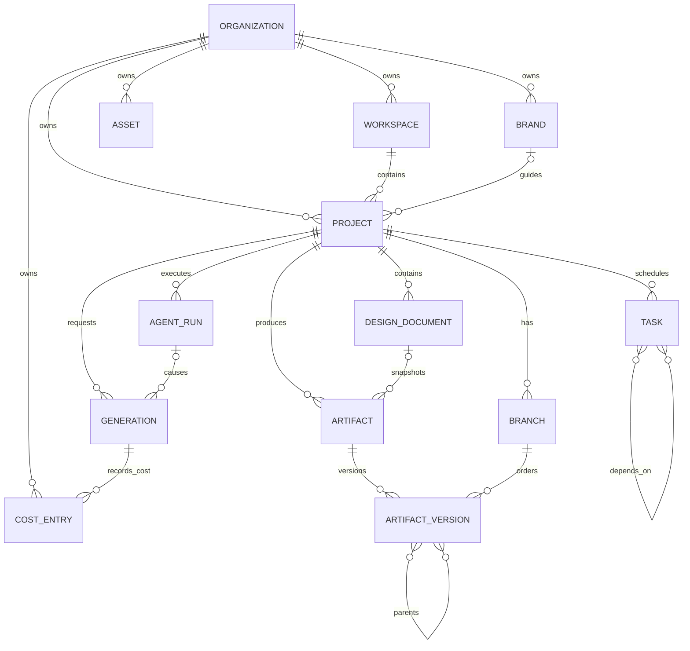

# LUMI AI Design OS — Domain Model V1

> Node: NODE-09  
> Status: IMPLEMENTED / VALIDATING  
> Date: 2026-08-16  
> Canonical Python skeleton: `apps/api/src/lumi_api/domain/`

## 1. Purpose

This document freezes the P0 business vocabulary before NODE-10 database schema and NODE-11 API contracts are implemented.

The domain layer defines **business meaning and invariants**. It is not an ORM schema, HTTP DTO set, LangGraph checkpoint schema, provider SDK model, or Pixi scene graph.

Dependency direction:

```text
HTTP / GraphQL / Agent / Workers / CLI
                ↓
        application services
                ↓
          domain semantics
                ↑
 repository/service protocols
                ↑
 SQL / Redis / object store / providers / queues
```

The domain package intentionally has no FastAPI, SQLAlchemy, Pydantic, LangGraph, LangChain, OpenAI, Anthropic, storage SDK, or queue dependency.

## 2. Bounded contexts

| Context | Owns | Does not own |
|---|---|---|
| Identity & Tenancy | Organization, membership/access decisions | Project lifecycle |
| Workspace / Project | Workspace, Project, project lifecycle | Agent runtime checkpoints |
| Brand | Brand profile, machine rules, forbidden rules | Knowledge ingestion internals |
| Asset | Input/reference media, storage ownership, rights metadata | Deliverable version history |
| Design | DesignDocument and future Design IR semantics | Pixi/Konva runtime objects |
| Artifact & Version | Artifact, Branch, ArtifactVersion, lineage/approval | Raw user upload role |
| Agent Execution | AgentRun business execution record | Project business truth |
| Workflow / Task | Task and dependency DAG | Provider-native job states |
| Generation / Provider | Generation request identity and normalized lifecycle | Agent orchestration graph |
| Billing / Cost | CostEntry immutable ledger semantics | Provider invoice implementation |
| Collaboration | Future member presence/comments/locks | Tenant membership source of truth |
| Audit / Governance | Future immutable audit facts/overrides | Direct mutation of approved history |
| Knowledge / Memory | Retrieval facts vs persistent experiential context | Project lifecycle ownership |

Cross-context relationships use domain IDs/contracts/events. A context must not import another context's ORM implementation.

## 3. Identity strategy

All application-owned business objects use UUIDv7-compatible 128-bit identifiers generated before persistence.

Current implementation: `lumi_api.domain.ids.new_uuid7()`.

Rules:

1. Database autoincrement IDs are never public domain identity.
2. Provider-native IDs are stored in `ProviderRef`; they never replace LUMI IDs.
3. UUIDv7 timestamp ordering is useful for locality/debugging but is not authorization or causal ordering.
4. Trace/event/log correlation should carry the same domain IDs.
5. Paid operations also carry an explicit `OperationIdentity` / idempotency key.

## 4. Aggregate glossary

### Organization

Tenant root. Owns plan/status/settings. It is the only P0 root entity that does not itself carry `organization_id` because its `id` is the tenant identity.

### Workspace

Collaboration container inside an Organization. P0 may create one default workspace but the model does not enforce a 1:1 organization/workspace relationship.

### Project

Long-lived business project with brief, brand association, active branch and lifecycle.

Project status is business truth and must never be inferred from LangGraph checkpoint state.

### Brand

Machine-usable brand profile/rules/forbidden rules. Brand **Memory** may later store learned knowledge, but Memory is not the same thing as enforceable Brand Rules.

### Asset

An input/reference/imported resource. Asset owns source, rights, semantic metadata and a `StorageRef` whose checksum and owner tenant are explicit.

### DesignDocument

Editable structured design document identified independently from any renderer. Future Design IR is the document payload semantics.

### Artifact

A deliverable or referenceable output produced/managed by LUMI: PNG, SVG, PDF, video, DesignDocument snapshot, etc.

### Branch / ArtifactVersion

Version lineage. Branch has a head version; ArtifactVersion has parent IDs and an approval state. Approved versions are immutable history; edits create another version.

### AgentRun

One business execution of an Agent runtime. Stores project/thread/config/graph versions, budget, usage and trace references. LangGraph checkpoints are an implementation detail behind this record.

### Task

A schedulable unit in the project/workflow DAG. Dependencies are domain IDs and must remain acyclic.

### Generation

One paid/idempotent external model generation/edit request. It is separate from AgentRun because one AgentRun may cause zero, one or many generations.

Provider errors are normalized into domain status rather than copied into the status field.

### CostEntry

Immutable ledger value. Charges, reversals and adjustments are new entries; an existing entry amount is never overwritten.

## 5. Asset vs Artifact vs DesignDocument

```text
Asset (input/reference)
   │
   ├───────────────┐
   ↓               ↓
Generation      DesignDocument
   │               │
   └──────┬────────┘
          ↓
       Artifact
          ↓
    ArtifactVersion
          ↓
    Branch / lineage
```

A physical file can participate in more than one lifecycle over time, but its **domain role is explicit**. Do not collapse Asset and Artifact into a generic `file` table whose meaning depends on flags.

## 6. Value objects

| Value Object | Core invariant |
|---|---|
| `Money` | amount is `Decimal`, never float; currency must match for arithmetic |
| `Dimensions` | positive finite width/height + explicit unit |
| `Point` | finite coordinates |
| `Rect` | finite coordinates; non-negative size |
| `Transform` | finite values; zero scale forbidden |
| `Color` | normalized `#RRGGBB` / `#RRGGBBAA` |
| `MimeType` | normalized MIME syntax |
| `StorageRef` | bucket/key + SHA-256 + owner organization |
| `ProviderRef` | provider name + provider-native ID |
| `ModelRef` | provider/model/version identity |
| `VersionRef` | artifact ID + version ID |
| `Usage` | non-negative decimal usage units |
| `Budget` | one currency; soft <= hard; non-negative |
| `RightsPolicy` | rights level + commercial/attribution policy |
| `OperationIdentity` | domain operation UUID + non-empty idempotency key |

## 7. Tenant scope rule

Every real tenant-owned P0 object carries `organization_id`:

```text
Workspace
Project
Brand
Asset
DesignDocument
Branch
Artifact
ArtifactVersion
AgentRun
Task
Generation
CostEntry
```

Cross-tenant object composition must pass `require_same_organization(...)` before the operation is accepted. Persistence will later reinforce this with composite/tenant-aware constraints and query policies; authorization still requires membership checks in the application/access layer.

## 8. State machines

### Project

```text
DRAFT → ACTIVE → ARCHIVED
          ↕
        PAUSED ─→ ARCHIVED
```

Terminal: `ARCHIVED`.

### AgentRun

```text
PENDING → RUNNING → SUCCEEDED
             │  ├→ FAILED
             │  ├→ WAITING_USER → RUNNING
             │  ├→ PAUSED ──────→ RUNNING
             │  └→ CANCEL_REQUESTED → CANCELLED
WAITING_USER/PAUSED ─→ CANCEL_REQUESTED
```

Terminal: `SUCCEEDED`, `FAILED`, `CANCELLED`.

### Task

```text
PENDING → READY → RUNNING → SUCCEEDED
   └→ CANCELLED   ├→ FAILED
                  ├→ CANCELLED
                  ├→ WAITING_USER ───────→ READY
                  └→ WAITING_DEPENDENCY ─→ READY
```

Terminal: `SUCCEEDED`, `FAILED`, `CANCELLED`.

### ArtifactVersion

```text
DRAFT → READY → APPROVED
  └────────┐
           └→ REJECTED
READY ───────→ REJECTED
```

Terminal: `APPROVED`, `REJECTED`. Approved is immutable history.

### Generation

```text
PENDING → RUNNING → COMPLETED
   └→ CANCELLED    ├→ FAILED
                   └→ CANCELLED
```

Provider-specific error codes live in normalized error metadata/contracts later, not in the enum.

## 9. Domain invariants

| # | Invariant | Current executable expression |
|---|---|---|
| 1 | Tenant-owned objects belong to an Organization | mandatory `organization_id` fields + `require_same_organization` |
| 2 | Access requires membership | `AccessPolicyService` port; implementation later |
| 3 | Artifact parent lineage cannot cycle | `require_artifact_lineage_acyclic` |
| 4 | Task dependency graph cannot cycle | `require_task_graph_acyclic` |
| 5 | Cost amount cannot be overwritten | frozen `CostEntry`; reversal/adjustment references prior entry |
| 6 | Approved version cannot be overwritten | frozen `ArtifactVersion` + terminal APPROVED transition |
| 7 | Hard constraints need audited override | policy/audit implementation later; semantic rule frozen here |
| 8 | Paid side effect has idempotency identity | `OperationIdentity`; Generation requires it |
| 9 | Storage object has checksum + owner | `StorageRef` + Asset owner match invariant |
| 10 | Provider error is not a domain status | `GenerationStatus` is normalized enum |

## 10. Domain services

Ports are defined in `domain/services.py` so business rules do not migrate into HTTP handlers:

```text
ProjectService
BrandPolicyService
DesignOperationService
ArtifactVersionService
TaskGraphService
GenerationService
CostLedgerService
ApprovalService
AccessPolicyService
```

These are boundaries, not mandatory microservices.

## 11. Repository ports

Defined in `domain/repositories.py`:

```text
ProjectRepository
AssetRepository
ArtifactRepository
TaskRepository
AgentRunRepository
CostLedgerRepository
```

The domain references these protocols, never SQLAlchemy Session. NODE-10/11 adapters may implement them.

## 12. Domain state vs LangGraph state

```text
Domain Project/AgentRun/Task state
= business truth
= durable product semantics

LangGraph State / checkpoint
= execution context
= resumability/orchestration implementation
```

Rules:

- deleting/rebuilding a checkpoint must not redefine Project lifecycle;
- a LangGraph node cannot bypass domain transition/invariant checks;
- checkpoint schema may reference domain IDs, but domain code must not import LangGraph;
- AgentRun records graph/config version so execution can be diagnosed without making the graph the aggregate root.

## 13. Memory vs Knowledge

```text
Memory
= persistent learned/user/project/agent experience
= preference/history/context

Knowledge
= source-backed retrievable facts/documents/assets
= provenance-bearing retrieval corpus
```

Brand Rules are neither: they are enforceable policy constraints.

## 14. Entity relationship map



This is a semantic map, not the final physical schema. NODE-10 must decide indexes, normalized tables, JSONB boundaries, foreign keys, RLS strategy, outbox tables and operational storage.

## 15. NODE-10 database translation contract

The database schema must preserve these decisions:

1. UUID domain IDs generated by the application; no public serial integer identity.
2. `organization_id` on tenant-owned tables and tenant-aware indexes.
3. Money stored exactly (`NUMERIC`/decimal semantics), not float/double.
4. cost ledger append-only semantics; reversal/adjustment links instead of UPDATE amount.
5. approved artifact versions immutable at application/database policy boundary.
6. task dependencies and artifact parent lineage represented explicitly, with cycle checks in domain/service logic and DB constraints where feasible.
7. storage checksum and tenant ownership persisted.
8. provider IDs separate from domain IDs.
9. AgentRun and Generation separate tables/aggregates.
10. LangGraph checkpoint persistence separate from Project business lifecycle columns.
11. Asset, DesignDocument, Artifact and ArtifactVersion remain separate domain roles.
12. status columns use normalized domain values and validated transition paths; provider raw state lives in metadata/error fields.

## 16. Test contract

`apps/api/tests/test_domain_model.py` is the executable P0 contract. It covers:

- UUIDv7 version/variant/time ordering;
- Decimal Money and currency isolation;
- Project transitions and terminal state;
- AgentRun wait/resume/success transitions;
- Task execution transitions;
- approved ArtifactVersion immutability;
- Asset/StorageRef tenant ownership;
- cross-tenant relationship rejection;
- Task DAG cycle rejection;
- Artifact lineage cycle rejection;
- immutable CostEntry and adjustment/reversal linking;
- normalized Generation lifecycle.

Any NODE-10/11 implementation that forces these tests to weaken must be treated as a domain-model change and explicitly reviewed rather than silently changing the meaning in persistence/API code.
