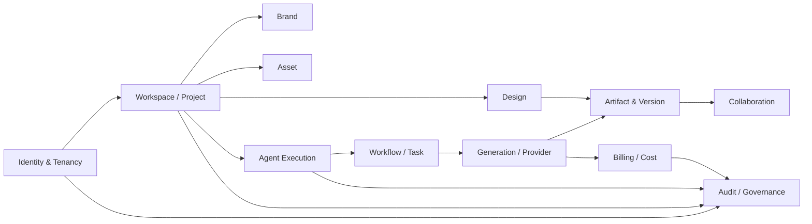
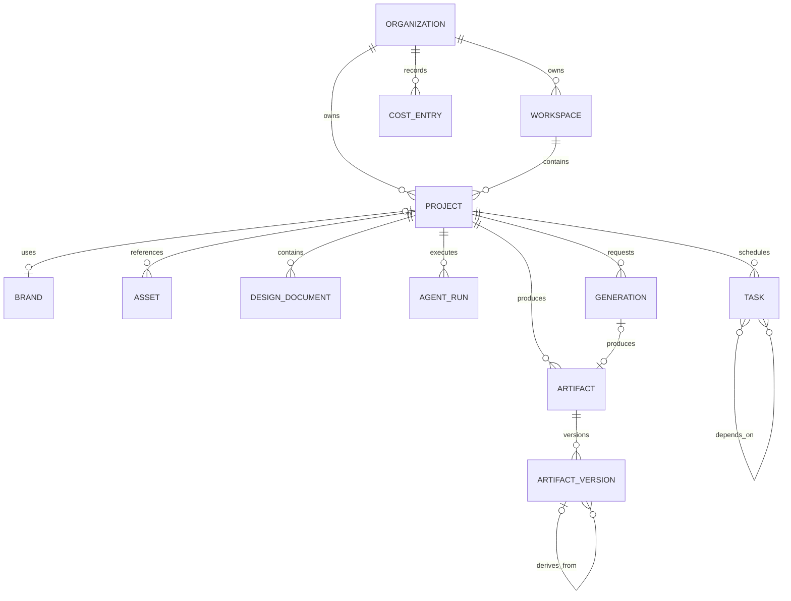
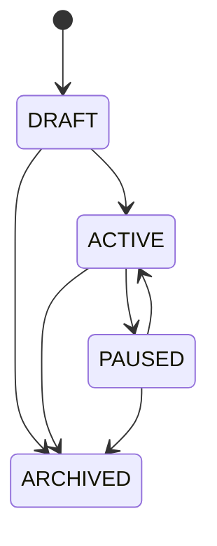
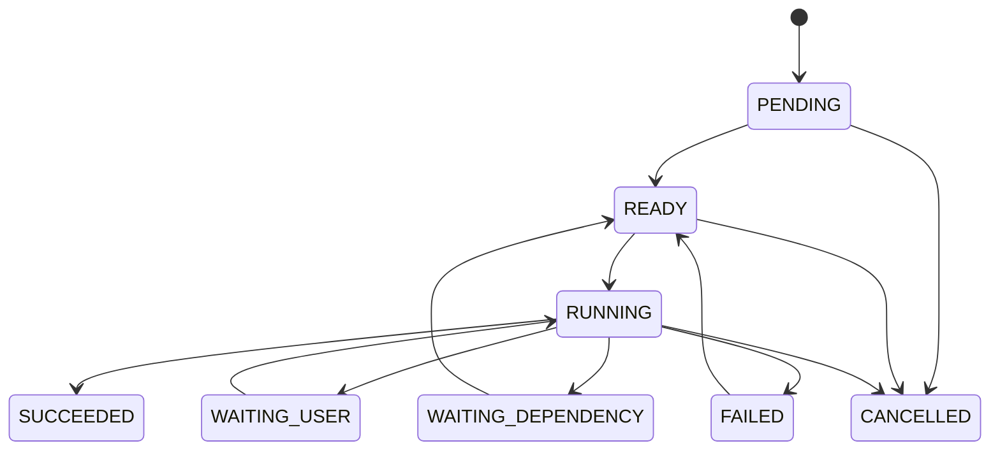
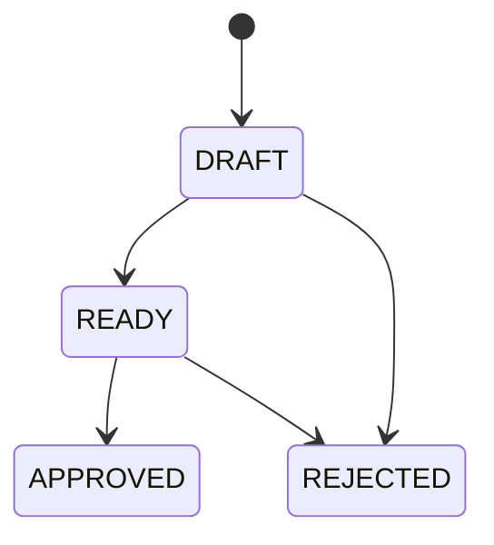

# LUMI AI Design OS — Domain Model V1

> Node: `NODE-09`  
> Status: **IMPLEMENTED / VALIDATING**  
> Principle: Domain semantics are independent from ORM, HTTP, renderer, LangGraph state and provider SDKs.

## 1. Purpose

This model freezes the shared language used by database, API, event, agent runtime and UI work before those layers are implemented. It is intentionally not a SQLAlchemy schema and not an OpenAPI model.

## 2. Bounded contexts



Cross-context relationships use IDs, contracts and domain events. One context must not import another context's ORM internals.

## 3. Identity strategy

Business objects use application-generated UUIDv7 identifiers.

Rules:

- no database auto-increment identifier is a public domain identity;
- provider-native IDs remain `ProviderRef`, not domain IDs;
- trace/event/log correlation can use the same domain IDs;
- UUIDv7 generation is persistence-independent and covered by tests.

## 4. Core domain responsibilities

| Concept | Responsibility | Must not become |
|---|---|---|
| Organization | tenant ownership root | billing provider customer object |
| Workspace | collaboration/project container | fixed 1:1 organization table assumption |
| Project | business project lifecycle | LangGraph checkpoint |
| Brand | profile + design policy references | Brand Memory blob |
| Asset | input/reference resource with storage + rights | generated deliverable version |
| DesignDocument | editable structured design identity | Pixi scene graph |
| Artifact | deliverable/result identity | raw upload |
| ArtifactVersion | immutable lineage/version state | mutable latest-file pointer |
| AgentRun | one agent execution business record | LangGraph state itself |
| Task | schedulable DAG unit | queue-native message |
| Generation | one normalized model generation/edit request | provider SDK response |
| CostEntry | immutable ledger movement | mutable balance row |

## 5. Aggregate relationship map



This diagram is semantic. NODE-10 owns the actual relational schema, indexes, foreign keys and outbox tables.

## 6. Value objects

Implemented in `lumi_domain.value_objects`:

- `Money` — Decimal only; float rejected;
- `Dimensions`, `Point`, `Rect`, `Transform`;
- `Color`, `MimeType`;
- `StorageRef` — bucket/key + SHA-256 checksum + owner organization;
- `ProviderRef`, `ModelRef`, `VersionRef`;
- `Usage`, `Budget`;
- `RightsPolicy`;
- `OperationIdentity` — domain operation ID + idempotency key;
- `NormalizedProviderError` — provider errors become normalized domain values before affecting business state.

## 7. State machines

### Project



### AgentRun

```mermaid
stateDiagram-v2
  [*] --> PENDING
  PENDING --> RUNNING
  PENDING --> CANCELLED
  RUNNING --> WAITING_USER
  WAITING_USER --> RUNNING
  RUNNING --> PAUSED
  PAUSED --> RUNNING
  RUNNING --> CANCEL_REQUESTED
  WAITING_USER --> CANCEL_REQUESTED
  PAUSED --> CANCEL_REQUESTED
  CANCEL_REQUESTED --> CANCELLED
  RUNNING --> SUCCEEDED
  RUNNING --> FAILED
```



### Task



### ArtifactVersion



`APPROVED` is terminal. Approved content is not overwritten; subsequent work forks/creates another version.

## 8. Invariants frozen by NODE-09

1. Project/Asset/Artifact/Task/Generation/AgentRun/CostEntry are tenant scoped by `organization_id`.
2. Tenant membership is required before domain object access.
3. Artifact lineage cannot contain cycles.
4. Task dependency DAG cannot contain cycles.
5. Cost entries are append-only values; correction creates reversal/adjustment entries.
6. Approved artifact versions cannot be rewritten/revised in place.
7. A violated hard constraint requires an audited override ID.
8. Paid side effects require an operation ID and idempotency key.
9. Storage references require SHA-256 checksum and ownership metadata; Asset owner must match StorageRef owner.
10. Provider-native errors are represented by normalized domain error codes rather than leaking provider exception types into domain state.

## 9. Critical separations

### Asset vs Artifact

- Asset = input/reference/imported resource.
- Artifact = produced/versioned result.
- lineage may connect them later, but their roles do not collapse.

### Project State vs LangGraph State

- Project state is business truth.
- LangGraph state is execution/checkpoint context.
- LangGraph never owns the Project lifecycle.

### Memory vs Knowledge

- Memory = durable experiential/user/project/agent context.
- Knowledge = retrievable source material and facts.

### DesignDocument vs Renderer Scene

- DesignDocument/Design IR is persistent product semantics.
- Pixi/Konva/Fabric scene objects are disposable runtime representations.

## 10. Ports

`lumi_domain.ports` declares Protocol boundaries for:

Repositories:

```text
ProjectRepository
AssetRepository
ArtifactRepository
TaskRepository
AgentRunRepository
CostLedgerRepository
```

Domain/application services:

```text
ProjectService
BrandPolicyService
DesignOperationService
ArtifactVersionService
TaskGraphService
GenerationService
CostLedgerService
ApprovalService
AccessPolicyService
```

NODE-10/NODE-11 implement adapters outside this package. The domain package imports no SQLAlchemy/FastAPI/httpx/provider SDK.

## 11. Domain event vocabulary

Candidate event names are frozen as semantic vocabulary; NODE-12 owns envelope/schema/transport rules:

```text
project.created
asset.ready
agent_run.started
agent_run.waiting_user
artifact.version_created
artifact.approved
task.succeeded
generation.completed
cost.recorded
```

## 12. Ownership of future details

- NODE-10: relational schema, Alembic, FK/index/outbox persistence;
- NODE-11: REST/OpenAPI and generated TS client;
- NODE-12: event envelope and delivery semantics;
- NODE-13: Design IR schema;
- NODE-15: complete artifact/version/provenance lineage;
- NODE-16: authentication, membership and RBAC adapters;
- NODE-20: side-effect reconciliation/idempotency runtime;
- NODE-27: full cost ledger/budget/quota service;
- NODE-28: LangGraph state/checkpoint implementation.

## 13. Acceptance contract

NODE-09 is accepted only when tests prove state transitions and invariants, and a static boundary test proves domain source does not import ORM, web framework, LangGraph/LangChain or provider SDK implementation modules.
